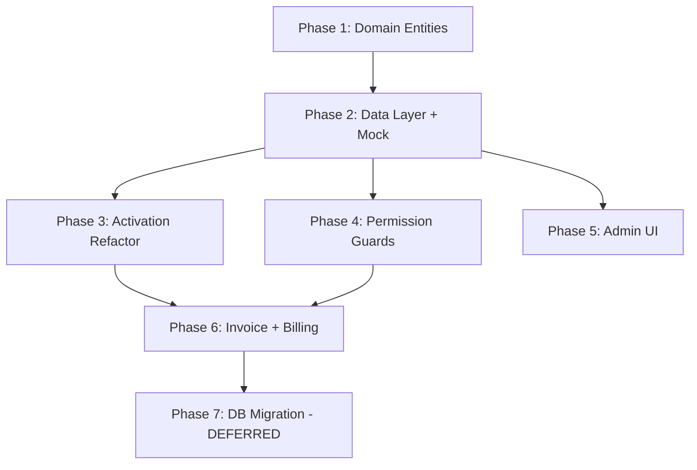

# Activation Plans, Permissions & Invoice System — Final Implementation Plan

## Goal

1. Replace hardcoded activation pricing with DB-driven **single JSONB config row** (+ per-user overrides)
2. Add **user_profiles** table with fine-grained permissions and business info
3. Add **invoice generation** (Syncfusion PDF) downloadable from profile
4. Build everything **mock-first** (no DB changes until satisfied)
5. **Defer DB migration** to final phase

---

## Final Decision Summary

| Decision                                     | Choice                                                                        |
| -------------------------------------------- | ----------------------------------------------------------------------------- |
| Pricing storage                              | Single JSONB `pricing_config` row per context (global/user)                   |
| Per-user pricing                             | Separate row with `user_id` set (UNIQUE constraint)                           |
| Plan resolution                              | User-specific overrides global; fallback to global if none                    |
| Audit trail                                  | `purchase_snapshot` JSONB on `activation_requests`                            |
| Permissions model                            | Fine-grained permission strings in JSONB array                                |
| Permission storage                           | `user_profiles` table with `permissions` + business info                      |
| Permission keys                              | `manage_tournament`, `manage_bracket`                                         |
| Default permissions on activation            | Set from `pricing_config.default_permissions` on approval                     |
| Guard pattern                                | `ActivationGuardBuilder` (top gate) + `PermissionGuardBuilder` (feature gate) |
| Admin can modify permissions post-activation | Yes                                                                           |
| UI style                                     | Keep current button/Wrap layout                                               |
| Admin UI                                     | Full CRUD: pricing config, user profiles, permissions                         |
| Invoice trigger                              | On admin approval                                                             |
| Invoice format                               | Syncfusion PDF, download-only                                                 |
| Invoice numbering                            | `GC-INV-YYYY-NNNN`                                                            |
| Invoice business identity                    | Hardcoded (seller side)                                                       |
| Invoice buyer details                        | From `user_profiles` business info                                            |
| Mock approach                                | `bool useMockData` flag in `AppConfig`                                        |
| DB migration                                 | Deferred to Phase 7                                                           |

---

## Schema Design (Reference — Applied in Phase 7)

### Table: `activation_plans`

```sql
CREATE TABLE activation_plans (
  id UUID PRIMARY KEY DEFAULT gen_random_uuid(),
  user_id UUID UNIQUE REFERENCES auth.users(id),  -- NULL = global default
  label TEXT NOT NULL DEFAULT 'Default Pricing',
  pricing_config JSONB NOT NULL DEFAULT '{}',
  is_active BOOLEAN NOT NULL DEFAULT true,
  created_at TIMESTAMPTZ DEFAULT now(),
  updated_at TIMESTAMPTZ DEFAULT now()
);
```

**`pricing_config` JSONB shape:**

```jsonc
{
  "base_rate_per_day": 800,
  "flat_discount_per_day": 50,
  "flat_discount_threshold_days": 15,
  "additive_options": [
    { "label": "+1 Day",  "days": 1,  "sort_order": 1 },
    { "label": "+7 Days", "days": 7,  "sort_order": 2 }
  ],
  "preset_plans": [
    { "label": "15 Days",  "days": 15,  "discount_percent": 15, "sort_order": 1 },
    { "label": "1 Month",  "days": 30,  "discount_percent": 25, "sort_order": 2 },
    { "label": "1 Year",   "days": 365, "discount_percent": 50, "sort_order": 3 }
  ],
  "default_permissions": [
    "manage_tournament",
    "manage_bracket"
  ]
}
```

### Table: `user_profiles`

```sql
CREATE TABLE user_profiles (
  id UUID PRIMARY KEY DEFAULT gen_random_uuid(),
  user_id UUID NOT NULL UNIQUE REFERENCES auth.users(id),
  organization_name TEXT DEFAULT '',
  address_line_1 TEXT DEFAULT '',
  address_line_2 TEXT DEFAULT '',
  tax_identification_number TEXT DEFAULT '',   -- GSTIN / PAN
  contact_email TEXT DEFAULT '',
  contact_phone TEXT DEFAULT '',
  permissions JSONB DEFAULT '[]',              -- ["manage_tournament", "manage_bracket"]
  created_at TIMESTAMPTZ DEFAULT now(),
  updated_at TIMESTAMPTZ DEFAULT now()
);
```

> [!IMPORTANT]
> `user_profiles` is created on first login (or on activation approval). The permissions JSONB starts empty and is populated on activation approval from `pricing_config.default_permissions`.

### Modify Table: `activation_requests`

```sql
ALTER TABLE activation_requests
  ADD COLUMN plan_config_id UUID REFERENCES activation_plans(id),
  ADD COLUMN purchase_snapshot JSONB DEFAULT '{}',
  ADD COLUMN invoice_number TEXT;
```

**`purchase_snapshot` JSONB shape:**

```jsonc
{
  "pricing_config_used": { /* full copy of pricing_config at time of purchase */ },
  "selected_preset_plan": {              // null if additive-only
    "label": "1 Month",
    "days": 30,
    "discount_percent": 25
  },
  "computed_days": 30,
  "base_rate_per_day": 800,
  "discount_type": "percent",            // "percent" | "flat" | "none"
  "discount_value": 25,
  "subtotal": 24000,
  "discount_amount": 6000,
  "total_amount": 18000
}
```

---

## Mock-First Strategy

### `AppConfig` Addition

```dart
abstract final class AppConfig {
  // ... existing flags ...

  /// When true, all new activation/profile datasources return mock in-memory data.
  /// Set to false + run DB migration to switch to real Supabase backend.
  static const bool useMockActivationData = true;
}
```

### DI Wiring Pattern

For each new datasource, two implementations exist:

```dart
// Abstract contract
abstract class ActivationPlanDataSource { ... }

// Real implementation (Supabase) — used when useMockActivationData = false
@LazySingleton(as: ActivationPlanDataSource)
@Environment('production')
class ActivationPlanRemoteDataSource implements ActivationPlanDataSource { ... }

// Mock implementation — used when useMockActivationData = true
class ActivationPlanMockDataSource implements ActivationPlanDataSource { ... }
```

Registration in DI:

```dart
// In injection module or manual registration
if (AppConfig.useMockActivationData) {
  getIt.registerLazySingleton<ActivationPlanDataSource>(
    () => ActivationPlanMockDataSource(),
  );
} else {
  getIt.registerLazySingleton<ActivationPlanDataSource>(
    () => ActivationPlanRemoteDataSource(getIt<SupabaseClient>()),
  );
}
```

> [!NOTE]
> The existing `ActivationRemoteDataSource` for activation requests stays as-is for now (it's already wired to Supabase). Only the **new** datasources (plans, profiles) use the mock pattern. When we flip the flag in Phase 7, we also update the existing datasource if needed.

---

## Phase 1: Domain Layer — New Entities

No file system changes to existing code. Pure domain modeling.

### Pricing Config Entities

#### [NEW] `lib/features/activation/domain/entities/pricing_config_entity.dart`

```dart
/// Represents a single additive option ("+1 Day", "+7 Days").
class AdditiveOptionEntity {
  final String label;
  final int days;
  final int sortOrder;

  const AdditiveOptionEntity({
    required this.label,
    required this.days,
    required this.sortOrder,
  });
}

/// Represents a preset plan ("15 Days", "1 Month", "1 Year").
class PresetPlanEntity {
  final String label;
  final int days;
  final int discountPercent;
  final int sortOrder;

  const PresetPlanEntity({
    required this.label,
    required this.days,
    required this.discountPercent,
    required this.sortOrder,
  });

  /// Computes the final price for this preset given a base rate.
  int computeTotalPrice(int baseRatePerDay) {
    final int baseCost = baseRatePerDay * days;
    return baseCost - (baseCost * discountPercent ~/ 100);
  }
}

/// The complete pricing configuration parsed from the JSONB column.
class PricingConfigEntity {
  final int baseRatePerDay;
  final int flatDiscountPerDay;
  final int flatDiscountThresholdDays;
  final List<AdditiveOptionEntity> additiveOptions;
  final List<PresetPlanEntity> presetPlans;
  final List<String> defaultPermissions;

  const PricingConfigEntity({
    required this.baseRatePerDay,
    required this.flatDiscountPerDay,
    required this.flatDiscountThresholdDays,
    required this.additiveOptions,
    required this.presetPlans,
    required this.defaultPermissions,
  });
}
```

#### [NEW] `lib/features/activation/domain/entities/activation_plan_config_entity.dart`

```dart
@freezed
class ActivationPlanConfigEntity with _$ActivationPlanConfigEntity {
  const factory ActivationPlanConfigEntity({
    required String id,
    String? userId,
    required String label,
    required PricingConfigEntity pricingConfig,
    required bool isActive,
    required DateTime createdAt,
    required DateTime updatedAt,
  }) = _ActivationPlanConfigEntity;
}
```

#### [NEW] `lib/features/activation/domain/entities/purchase_snapshot_entity.dart`

```dart
/// Immutable audit record of exactly what the user purchased.
class PurchaseSnapshotEntity {
  final Map<String, dynamic> pricingConfigUsed;
  final PresetPlanEntity? selectedPresetPlan;
  final int computedDays;
  final int baseRatePerDay;
  final String discountType;    // "percent" | "flat" | "none"
  final int discountValue;
  final int subtotal;
  final int discountAmount;
  final int totalAmount;
  
  // ... constructor, toJson(), fromJson() ...
}
```

### User Profile Entity

#### [NEW] `lib/features/profile/domain/entities/user_profile_entity.dart`

```dart
@freezed
class UserProfileEntity with _$UserProfileEntity {
  const factory UserProfileEntity({
    required String id,
    required String userId,
    @Default('') String organizationName,
    @Default('') String addressLine1,
    @Default('') String addressLine2,
    @Default('') String taxIdentificationNumber,
    @Default('') String contactEmail,
    @Default('') String contactPhone,
    @Default([]) List<String> permissions,
    required DateTime createdAt,
    required DateTime updatedAt,
  }) = _UserProfileEntity;

  const UserProfileEntity._();

  bool hasPermission(String permission) => permissions.contains(permission);
}
```

### Permission Constants

#### [NEW] `lib/features/activation/domain/constants/activation_permissions.dart`

```dart
/// Canonical permission string constants used throughout the application.
abstract final class ActivationPermissions {
  static const String manageTournament = 'manage_tournament';
  static const String manageBracket = 'manage_bracket';

  /// All permissions that ship with default activation.
  static const List<String> defaultPermissions = [
    manageTournament,
    manageBracket,
  ];
}
```

### Modify Activation Request Entity

#### [MODIFY] `lib/features/activation/domain/entities/activation_request_entity.dart`

Add fields:
- `String? planConfigId`
- `PurchaseSnapshotEntity? purchaseSnapshot`
- `String? invoiceNumber`

---

## Phase 2: Data Layer — Models, Datasources, Repositories

### Pricing Config Data Layer

#### [NEW] `lib/features/activation/data/models/activation_plan_config_model.dart`

Freezed model with `@JsonKey` mappings for the `activation_plans` table.
Includes nested parsing of `pricing_config` JSONB → `PricingConfigEntity`.

#### [NEW] `lib/features/activation/data/datasources/activation_plan_datasource.dart`

Abstract contract + mock implementation:

```dart
abstract class ActivationPlanDataSource {
  Future<ActivationPlanConfigModel?> fetchEffectivePricingConfig(String userId);
  Future<List<ActivationPlanConfigModel>> fetchAllPlanConfigs();
  Future<ActivationPlanConfigModel> insertPlanConfig({
    String? userId,
    required String label,
    required Map<String, dynamic> pricingConfig,
  });
  Future<void> updatePlanConfig({
    required String planConfigId,
    String? label,
    Map<String, dynamic>? pricingConfig,
    bool? isActive,
  });
  Future<void> deletePlanConfig({required String planConfigId});
}
```

**Mock implementation** (`ActivationPlanMockDataSource`):
- Holds an in-memory `List<ActivationPlanConfigModel>` seeded with the default global config
- All CRUD operations work on the in-memory list
- `fetchEffectivePricingConfig(userId)` returns user-specific if exists, else global

### User Profile Data Layer

#### [NEW] `lib/features/profile/data/models/user_profile_model.dart`

Freezed model mapping `user_profiles` table columns.

#### [NEW] `lib/features/profile/data/datasources/user_profile_datasource.dart`

Abstract contract + mock implementation:

```dart
abstract class UserProfileDataSource {
  Future<UserProfileModel?> fetchProfileByUserId(String userId);
  Future<UserProfileModel> createProfile({
    required String userId,
    String? organizationName,
    List<String>? permissions,
  });
  Future<void> updateProfile({
    required String userId,
    String? organizationName,
    String? addressLine1,
    String? addressLine2,
    String? taxIdentificationNumber,
    String? contactEmail,
    String? contactPhone,
  });
  Future<void> updatePermissions({
    required String userId,
    required List<String> permissions,
  });
  Future<List<UserProfileModel>> fetchAllProfiles();  // admin
}
```

**Mock implementation** (`UserProfileMockDataSource`):
- In-memory map keyed by `userId`
- Seeded with a profile for the current mock user

### Repository Layer

#### [NEW] `lib/features/activation/domain/repositories/i_activation_plan_repository.dart`

```dart
abstract class IActivationPlanRepository {
  Future<Either<Failure, ActivationPlanConfigEntity>> getEffectivePricingConfig();
  Future<Either<Failure, List<ActivationPlanConfigEntity>>> getAllPlanConfigs();
  Future<Either<Failure, ActivationPlanConfigEntity>> createPlanConfig({...});
  Future<Either<Failure, Unit>> updatePlanConfig({...});
  Future<Either<Failure, Unit>> deletePlanConfig({required String planConfigId});
}
```

#### [NEW] `lib/features/activation/data/repositories/activation_plan_repository_impl.dart`

Wraps `ActivationPlanDataSource` with try/catch + Either.

#### [NEW] `lib/features/profile/domain/repositories/i_user_profile_repository.dart`

```dart
abstract class IUserProfileRepository {
  Future<Either<Failure, UserProfileEntity>> getOrCreateCurrentUserProfile();
  Future<Either<Failure, Unit>> updateCurrentUserProfile({...});
  Future<Either<Failure, Unit>> updateUserPermissions({
    required String userId,
    required List<String> permissions,
  });
  Future<Either<Failure, List<UserProfileEntity>>> getAllUserProfiles();  // admin
}
```

#### [NEW] `lib/features/profile/data/repositories/user_profile_repository_impl.dart`

### Modify Existing Activation Data Layer

#### [MODIFY] `lib/features/activation/data/models/activation_request_model.dart`

Add fields: `planConfigId`, `purchaseSnapshot` (as `Map<String, dynamic>`), `invoiceNumber`.

#### [MODIFY] `lib/features/activation/data/datasources/activation_remote_datasource.dart`

- `submitActivationRequest` gains: `planConfigId`, `purchaseSnapshot` parameters
- `updateActivationRequestStatus` gains: `invoiceNumber` parameter
- New: `fetchApprovedRequestsForCurrentUser()`

> [!NOTE]
> These changes to the existing datasource work with both mock and real Supabase. The new columns (`plan_config_id`, `purchase_snapshot`, `invoice_number`) will be NULL until Phase 7 migration runs, but they won't break existing functionality since they're all nullable.

### DI Registration

#### [NEW] `lib/features/activation/data/datasources/activation_plan_mock_datasource.dart`

#### [NEW] `lib/features/profile/data/datasources/user_profile_mock_datasource.dart`

#### [MODIFY] `lib/core/di/injection_module.dart` (or equivalent manual DI)

Register mock or real datasources based on `AppConfig.useMockActivationData`:

```dart
if (AppConfig.useMockActivationData) {
  getIt.registerLazySingleton<ActivationPlanDataSource>(
    () => ActivationPlanMockDataSource(),
  );
  getIt.registerLazySingleton<UserProfileDataSource>(
    () => UserProfileMockDataSource(),
  );
} else {
  getIt.registerLazySingleton<ActivationPlanDataSource>(
    () => ActivationPlanRemoteDataSource(getIt<SupabaseClient>()),
  );
  getIt.registerLazySingleton<UserProfileDataSource>(
    () => UserProfileRemoteDataSource(getIt<SupabaseClient>()),
  );
}
```

#### [MODIFY] `lib/core/config/app_config.dart`

Add `static const bool useMockActivationData = true;`

---

## Phase 3: Activation Flow Refactor

### Bloc Layer

#### [MODIFY] `lib/features/activation/presentation/bloc/activation_event.dart`

```dart
@freezed
class ActivationEvent with _$ActivationEvent {
  /// Fired on screen mount — loads effective pricing config from repository.
  const factory ActivationEvent.loadPricingConfig() = _LoadPricingConfig;
  /// User clicked an additive option ("+1 Day", "+7 Days").
  const factory ActivationEvent.addDays(int days) = _AddDays;
  /// User selected a preset plan ("15 Days", "1 Month", "1 Year").
  const factory ActivationEvent.presetPlanSelected(PresetPlanEntity plan) = _PresetPlanSelected;
  /// User cleared their current selection.
  const factory ActivationEvent.clearDays() = _ClearDays;
  /// User typed in the contact name field.
  const factory ActivationEvent.contactNameChanged(String name) = _ContactNameChanged;
  /// User tapped submit.
  const factory ActivationEvent.submitRequested() = _SubmitRequested;
}
```

#### [MODIFY] `lib/features/activation/presentation/bloc/activation_state.dart`

```dart
@freezed
class ActivationState with _$ActivationState {
  const factory ActivationState({
    @Default(0) int requestedDays,
    @Default('') String contactName,
    @Default(false) bool isLoading,
    @Default(false) bool isSuccess,
    @Default(false) bool isConfigLoading,
    ActivationPlanConfigEntity? activePlanConfig,
    PresetPlanEntity? selectedPresetPlan,
    Failure? error,
  }) = _ActivationState;

  const ActivationState._();

  // ----- Computed pricing from DB config -----
  
  PricingConfigEntity? get _pricingConfig => activePlanConfig?.pricingConfig;
  
  int get baseRatePerDay => _pricingConfig?.baseRatePerDay ?? 800;
  int get flatDiscountPerDay => _pricingConfig?.flatDiscountPerDay ?? 50;
  int get flatDiscountThresholdDays => _pricingConfig?.flatDiscountThresholdDays ?? 15;

  int get subtotal => requestedDays * baseRatePerDay;

  String get discountType {
    if (selectedPresetPlan != null) return 'percent';
    if (requestedDays > 0 && requestedDays < flatDiscountThresholdDays) return 'flat';
    return 'none';
  }

  int get discountPercent {
    if (selectedPresetPlan != null) return selectedPresetPlan!.discountPercent;
    return 0;
  }

  int get discountAmount {
    if (requestedDays <= 0) return 0;
    switch (discountType) {
      case 'percent':
        return (subtotal * selectedPresetPlan!.discountPercent) ~/ 100;
      case 'flat':
        return flatDiscountPerDay * requestedDays;
      default:
        return 0;
    }
  }

  int get totalAmount => subtotal - discountAmount;

  /// Builds the purchase snapshot for JSONB audit storage.
  Map<String, dynamic> buildPurchaseSnapshot() {
    return {
      'pricing_config_used': _pricingConfig != null
          ? _serializePricingConfig(_pricingConfig!)
          : null,
      'selected_preset_plan': selectedPresetPlan != null
          ? {
              'label': selectedPresetPlan!.label,
              'days': selectedPresetPlan!.days,
              'discount_percent': selectedPresetPlan!.discountPercent,
            }
          : null,
      'computed_days': requestedDays,
      'base_rate_per_day': baseRatePerDay,
      'discount_type': discountType,
      'discount_value': discountType == 'percent'
          ? discountPercent
          : (discountType == 'flat' ? flatDiscountPerDay : 0),
      'subtotal': subtotal,
      'discount_amount': discountAmount,
      'total_amount': totalAmount,
    };
  }
}
```

#### [MODIFY] `lib/features/activation/presentation/bloc/activation_bloc.dart`

- On `loadPricingConfig`: call `IActivationPlanRepository.getEffectivePricingConfig()`, set state
- On `presetPlanSelected(plan)`: set `requestedDays = plan.days`, `selectedPresetPlan = plan`
- On `addDays(days)`: clear `selectedPresetPlan`, add days (pure additive)
- On `submitRequested`: include `planConfigId` and `purchaseSnapshot` in repository call

### On Approval — Permission Assignment

#### [MODIFY] `lib/features/activation/data/repositories/activation_repository_impl.dart`

In `approveActivationRequest`:
1. Fetch the plan config used (from `request.planConfigId` or fallback to global)
2. Extract `default_permissions` from the plan's `pricing_config`
3. Call `UserProfileDataSource.updatePermissions(userId, permissions)`
4. Generate invoice number: `GC-INV-YYYY-NNNN`
5. Mark request as approved with `invoiceNumber`
6. Create/extend `user_activations` (existing logic)

### UI Changes

#### [MODIFY] `lib/features/activation/presentation/screens/activate_software_screen.dart`

- On mount: dispatch `ActivationEvent.loadPricingConfig()`
- Show loading spinner while `state.isConfigLoading`
- Replace hardcoded `Wrap` buttons with dynamic rendering from `state.activePlanConfig`:

```dart
// Additive options
for (final option in config.pricingConfig.additiveOptions.sorted)
  OutlinedButton.icon(
    icon: Icon(Icons.add),
    label: Text(option.label),
    onPressed: () => bloc.add(ActivationEvent.addDays(option.days)),
  ),

// Preset plans
for (final plan in config.pricingConfig.presetPlans.sorted)
  OutlinedButton.icon(
    icon: Icon(Icons.check_circle_outline),
    label: Text('${plan.label} (Save ${plan.discountPercent}%)'),
    style: OutlinedButton.styleFrom(...),  // styled per discount tier
    onPressed: () => bloc.add(ActivationEvent.presetPlanSelected(plan)),
  ),
```

- Pricing summary reads from computed state getters (all DB-driven)
- Remove hardcoded `setDays` calls
- Submit sends `purchaseSnapshot` built from state

---

## Phase 4: Permission Guards

#### [NEW] `lib/features/activation/presentation/widgets/permission_guard_builder.dart`

```dart
/// Widget that checks whether the current user has a specific permission.
///
/// Composes with [ActivationGuardBuilder] — activation is the top-level gate,
/// this is the feature-specific gate.
class PermissionGuardBuilder extends StatelessWidget {
  const PermissionGuardBuilder({
    super.key,
    required this.requiredPermission,
    required this.builder,
  });

  final String requiredPermission;
  final Widget Function(BuildContext context, bool isAllowed) builder;

  @override
  Widget build(BuildContext context) {
    return BlocBuilder<UserProfileBloc, UserProfileState>(
      builder: (context, profileState) {
        final bool isAllowed = profileState.currentProfile
            ?.hasPermission(requiredPermission) ?? false;
        return builder(context, isAllowed);
      },
    );
  }
}
```

#### [NEW] `lib/features/profile/presentation/bloc/user_profile_bloc.dart`
#### [NEW] `lib/features/profile/presentation/bloc/user_profile_event.dart`
#### [NEW] `lib/features/profile/presentation/bloc/user_profile_state.dart`

Singleton bloc that loads the current user's profile (including permissions) on login.
Exposes `UserProfileEntity? currentProfile` in state.

Events: `loadRequested`, `clearRequested` (on sign-out), `profileUpdated`

#### Integration Points

- **Dashboard**: Wrap "Create Tournament" button with `PermissionGuardBuilder(requiredPermission: ActivationPermissions.manageTournament)`
- **Tournament Detail**: Wrap "Add Bracket" FAB with `PermissionGuardBuilder(requiredPermission: ActivationPermissions.manageBracket)`
- **Existing `ActivationGuardBuilder`**: Stays as-is — checks activation status (is active or not)
- Both guards can nest: `ActivationGuardBuilder` → `PermissionGuardBuilder`

---

## Phase 5: Admin UI

### Plan Config Management

#### [NEW] `lib/features/activation/presentation/screens/admin_plan_config_screen.dart`

Two sections:

**Section 1: Global Pricing Configuration**
- Card showing current global config
- Editable fields: base rate, flat discount/day, flat discount threshold
- Editable list of additive options (label + days, add/remove rows)
- Editable list of preset plans (label + days + discount %, add/remove rows)
- Editable list of default permissions (multi-select from known permissions)
- "Save Changes" button

**Section 2: User-Specific Overrides**
- DataTable: User Email | Label | Base Rate | Presets Count | Active | Actions
- "Add Override" FAB → dialog: search user, configure full pricing config for them
- Edit button → same dialog pre-filled
- Delete button with confirmation

#### [NEW] `lib/features/activation/presentation/bloc/admin_plan_config_bloc.dart`
#### [NEW] `lib/features/activation/presentation/bloc/admin_plan_config_event.dart`
#### [NEW] `lib/features/activation/presentation/bloc/admin_plan_config_state.dart`

### User Profile Management (Admin)

#### [NEW] `lib/features/profile/presentation/screens/admin_user_profiles_screen.dart`

- DataTable of all users: Email | Org Name | Permissions | Activation Status | Actions
- Edit permissions per user (multi-select from known permissions)
- View/edit business info

#### [NEW] `lib/features/profile/presentation/bloc/admin_user_profiles_bloc.dart`
#### [NEW] `lib/features/profile/presentation/bloc/admin_user_profiles_event.dart`
#### [NEW] `lib/features/profile/presentation/bloc/admin_user_profiles_state.dart`

### Route & Navigation

#### [MODIFY] `lib/core/router/app_routes.dart`

Add routes:
- `/admin/pricing` → `AdminPlanConfigScreen`
- `/admin/users` → `AdminUserProfilesScreen`

#### [MODIFY] Dashboard admin navigation

Add menu entries for "Manage Pricing" and "Manage Users" (visible only when `isAdmin`).

---

## Phase 6: Invoice Generation & Profile Billing

### Invoice PDF Service

#### [NEW] `lib/features/activation/data/services/activation_invoice_pdf_service.dart`

Syncfusion PDF service following the pattern from `lib/features/invoice/`.

**Input**: `ActivationRequestEntity` (with `purchaseSnapshot` + `invoiceNumber`) + `UserProfileEntity` (buyer details)

**Maps to `InvoiceDataEntity`**:

| Invoice Field    | Source                                                                            |
| ---------------- | --------------------------------------------------------------------------------- |
| Company (seller) | Hardcoded: "Asif Akhtar (Indie Softwares)", Rohini Delhi, PAN: CWKPA1964R         |
| Client (buyer)   | From `UserProfileEntity`: org name, address, tax ID, contact                      |
| Invoice #        | `request.invoiceNumber`                                                           |
| Issue date       | `request.reviewedAt`                                                              |
| Due date         | Same as issue date (paid upfront)                                                 |
| Line item name   | `purchaseSnapshot.selectedPresetPlan.label` or "Custom Activation"                |
| Line item qty    | `purchaseSnapshot.computedDays` (days)                                            |
| Line item rate   | `purchaseSnapshot.baseRatePerDay`                                                 |
| Discount line    | From `purchaseSnapshot.discountAmount` if > 0                                     |
| Total            | `purchaseSnapshot.totalAmount`                                                    |
| Payment status   | Marked as "PAID"                                                                  |
| Legal notice     | "Supplier is not registered under GST. No GST charged under threshold exemption." |

**Method**: `Future<Uint8List> generateActivationInvoicePdf({ required ActivationRequestEntity request, required UserProfileEntity buyerProfile })`

Uses `printing` package for browser download trigger.

### Invoice Number Generation

In `activation_repository_impl.dart` → `approveActivationRequest`:

```dart
// Query max existing invoice number
final maxInvoiceNumber = await _dataSource.fetchMaxInvoiceNumber();
final year = DateTime.now().year;
final nextSequence = (maxInvoiceNumber != null)
    ? _extractSequence(maxInvoiceNumber) + 1
    : 1;
final invoiceNumber = 'GC-INV-$year-${nextSequence.toString().padLeft(4, '0')}';
```

### Billing Datasource Additions

#### [MODIFY] `lib/features/activation/data/datasources/activation_remote_datasource.dart`

New methods:
- `fetchApprovedRequestsForCurrentUser()` — `SELECT * FROM activation_requests WHERE user_id = :uid AND status = 'approved' ORDER BY created_at DESC`
- `fetchMaxInvoiceNumber()` — `SELECT invoice_number FROM activation_requests WHERE invoice_number IS NOT NULL ORDER BY invoice_number DESC LIMIT 1`

### Profile Billing Card

#### [NEW] `lib/features/profile/presentation/widgets/billing_invoices_card.dart`

Card widget for profile screen:

```
┌─────────────────────────────────────────────────┐
│ 📄 Billing & Invoices                           │
│                                                 │
│  Date         Plan          Days   Amount  ⬇️   │
│  ─────────────────────────────────────────────── │
│  12 Apr 2026  1 Month       30    ₹18,000  📥  │
│  01 Mar 2026  Custom         7     ₹5,250  📥  │
│                                                 │
│  No more transactions                           │
└─────────────────────────────────────────────────┘
```

- Each row reads from `ActivationRequestEntity` (approved ones)
- Plan label extracted from `purchaseSnapshot.selectedPresetPlan.label` (or "Custom")
- Download icon calls `ActivationInvoicePdfService` → triggers download

#### [NEW] `lib/features/profile/presentation/bloc/billing_bloc.dart`
#### [NEW] `lib/features/profile/presentation/bloc/billing_event.dart`
#### [NEW] `lib/features/profile/presentation/bloc/billing_state.dart`

Simple bloc: loads approved requests on mount.

#### [MODIFY] `lib/features/profile/presentation/screens/profile_screen.dart`

Insert `BillingInvoicesCard()` between `_SoftwareStatusCard` and `_DangerZoneCard`.

Also add a **"Business Information"** section to the profile screen where the user can edit their org name, address, tax ID (saved to `user_profiles`). This ensures invoices have correct buyer details.

---

## Phase 7 (Deferred): Database Migration

When satisfied with mock implementation:

1. **Create tables** via Supabase MCP: `activation_plans`, `user_profiles`
2. **Alter** `activation_requests`: add `plan_config_id`, `purchase_snapshot`, `invoice_number`
3. **Apply RLS policies** (as documented in Schema Design section above)
4. **Seed default global config** (the default pricing INSERT above)
5. **Create real datasource implementations**: `ActivationPlanRemoteDataSource`, `UserProfileRemoteDataSource`
6. **Flip flag**: `AppConfig.useMockActivationData = false`
7. **Run verification queries** against live DB
8. **Update `supabase-schema.md`** planning artifact

---

## Verification Plan

### Per-Phase Verification

| Phase   | Verification                                                                             |
| ------- | ---------------------------------------------------------------------------------------- |
| Phase 1 | Entities compile, freezed codegen succeeds                                               |
| Phase 2 | Mock datasources return expected data, repository Either wrapping works                  |
| Phase 3 | Activation screen loads mock plans, pricing computes correctly, submit includes snapshot |
| Phase 4 | Permission guards show/hide features based on mock profile permissions                   |
| Phase 5 | Admin screens CRUD plans and profiles via mock datasources                               |
| Phase 6 | Invoice PDF generates correctly from mock data, profile shows billing card               |
| Phase 7 | All above verified against real Supabase tables                                          |

### Automated Tests

1. `PricingConfigEntity` — JSONB → Dart parsing round-trip
2. `ActivationState` computed properties — preset discounts, flat discounts, edge cases (0 days, threshold boundary)
3. `ActivationBloc` — config loading, plan selection, additive accumulation, mode switching, snapshot building
4. `UserProfileEntity.hasPermission` — permission checking
5. `PurchaseSnapshotEntity` — serialization/deserialization
6. Invoice number sequence generation

### Manual Verification Checklist

- [ ] Activation screen loads plans from mock
- [ ] Preset plan selection → correct pricing display
- [ ] Additive "+1 Day" / "+7 Days" → correct accumulation and flat discount
- [ ] Switching from preset to additive clears preset selection
- [ ] Submit → purchase_snapshot data structure is correct
- [ ] Admin → edit global config → user screen reflects changes
- [ ] Admin → create user-specific override → target user sees custom plans
- [ ] Admin → approve request → permissions assigned, invoice number generated
- [ ] Permission guards → features locked/unlocked per permissions
- [ ] Profile → business info editable
- [ ] Profile → billing card shows approved transactions
- [ ] Profile → download invoice PDF → correct content

---

## Phase Execution Order



> [!NOTE]
> Phases 3, 4, and 5 can run in parallel after Phase 2. Phase 6 depends on 3 and 4.
