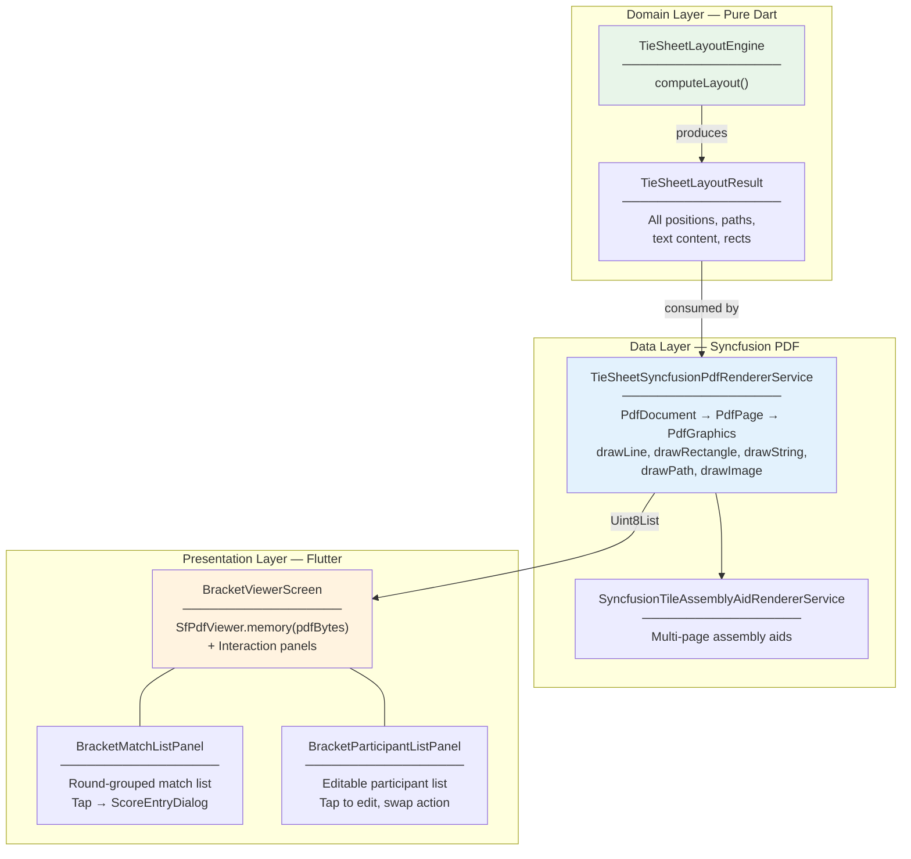

# PDF-Native Bracket Architecture: Syncfusion PDF Viewer + Vector Export

Render the bracket as an **in-memory PDF** using `syncfusion_flutter_pdf`, display it on-screen using `SfPdfViewer.memory(bytes)`. What you see IS the PDF — **zero rendering divergence** between screen and export.

All `CustomPainter` code eliminated. No widget-based bracket rendering. The bracket visual is always a PDF document. Interactions move to separate panels alongside the viewer.

---

## User Review Required

> [!CAUTION]
> **Complete rendering paradigm shift.** The bracket is no longer drawn with Flutter's Canvas or Flutter widgets. It is drawn as a vector PDF document using Syncfusion's `PdfDocument → PdfPage → PdfGraphics` API, then displayed on-screen via `SfPdfViewer.memory(pdfBytes)`. The same bytes are sent to `Printing.layoutPdf()` for export. There is ONE renderer, ONE output, ZERO visual divergence.

> [!IMPORTANT]
> **All bracket interactions are removed from the bracket visual.** No tap-on-junction for score entry. No drag-drop on participant rows. No tap-on-row for editing. These features are **not removed** — they are **relocated** to proper Flutter UI panels alongside the PDF viewer:
> - **Score entry** → A match list panel grouped by round. Tap a match → ScoreEntryDialog opens.
> - **Participant edit** → A participant list panel. Tap a participant → ParticipantEditDialog opens.
> - **Participant swap** → Select two participants in the list and swap them.
> - **Edit mode toggle** → stays; when active, it shows the participant management panel.

> [!WARNING]
> **PDF regeneration on data change.** When a score is recorded or participant is edited, the bracket data changes → layout engine recomputes → PDF renderer regenerates → `SfPdfViewer` refreshes. For a typical 16-player bracket (~35 rows, ~15 junctions, ~30 connectors), Syncfusion PDF generation is well under 200ms. If performance is a concern on very large brackets, we can add debouncing.

> [!IMPORTANT]
> **`pdf` package stays as transitive dependency** of `printing: ^5.14.2`. All direct imports of `pdf/widgets.dart` (`pw.Document`, `pw.Page`, `pw.Image`) are removed. `Printing.layoutPdf()` only needs `Uint8List` bytes.

---

## Architecture Overview



**Data flow on user action:**
```
User scores a match → BracketBloc updates state → 
  → TieSheetLayoutEngine.computeLayout() 
  → TieSheetSyncfusionPdfRendererService.generateBracketPdfDocument()
  → setState(() => _cachedPdfBytes = newBytes)
  → SfPdfViewer.memory(_cachedPdfBytes) rebuilds
```

---

## File Structure

```
lib/features/bracket/
├── domain/
│   └── layout/                                         ← NEW DIRECTORY
│       ├── models/                                     ← NEW DIRECTORY
│       │   ├── tie_sheet_layout_result.dart              ← [NEW]
│       │   ├── header_layout_data.dart                   ← [NEW]
│       │   ├── match_layout_data.dart                    ← [NEW]
│       │   ├── connector_layout_data.dart                ← [NEW]
│       │   ├── medal_table_layout_data.dart              ← [NEW]
│       │   ├── section_label_layout_data.dart            ← [NEW]
│       │   └── participant_row_layout_data.dart          ← [NEW]
│       └── tie_sheet_layout_engine.dart                  ← [NEW]
├── presentation/
│   ├── screens/
│   │   └── bracket_viewer_screen.dart                    ← [MODIFY] major rewrite
│   └── widgets/
│       ├── bracket_match_list_panel.dart                 ← [NEW] replaces tap-on-junction
│       ├── bracket_participant_list_panel.dart           ← [NEW] replaces edit-mode drag/tap
│       ├── print_preview_dialog.dart                     ← [MODIFY] uses PDF bytes directly
│       ├── tie_sheet_canvas_widget.dart                  → [RENAME .deprecated.txt]
│       └── participant_slot_hit_area.dart                → [DELETE] no longer needed
├── data/
│   └── services/
│       ├── tie_sheet_syncfusion_pdf_renderer_service.dart    ← [NEW]
│       ├── syncfusion_tile_assembly_aid_renderer_service.dart ← [NEW]
│       ├── bracket_pdf_generator_service.dart                → [RENAME .deprecated.txt]
│       └── tile_assembly_aid_renderer.dart                   → [RENAME .deprecated.txt]
```

---

## Proposed Changes

### Phase 1 — Layout Models (Domain Layer)

No changes from the previous plan's model definitions. These remain the same:

- `TieSheetLayoutResult` — top-level container
- `TieSheetLayoutDimensions` — cached dimensional tokens
- `HeaderLayoutData` — banner, logos, classification info row
- `ParticipantRowLayoutData` — single participant card geometry
- `MatchLayoutData` — junction node: badges, pill, winner text
- `ConnectorLayoutData` — line segments and arc paths
- `MedalTableLayoutData` — 4-row medal table
- `SectionLabelLayoutData` — DE section labels
- `PositionedTextLayoutData` — text content + position + style info
- `LineSegmentLayoutData` — start/end offset pair

All are pure Dart, `const`-constructible, immutable. See previous revision for full field-level specs.

---

### Phase 2 — Layout Engine (Domain Layer)

#### [NEW] [tie_sheet_layout_engine.dart](file:///Users/asak/Documents/dev/proj/personal/tkd_saas/lib/features/bracket/domain/layout/tie_sheet_layout_engine.dart)

Same extraction as the previous plan — all calculation logic from `TieSheetPainter` moves here. See previous revision for the full method-by-method extraction table.

Key difference: the engine **no longer needs to track hit areas or interactive bounding rects** — since there are no canvas interactions. We can simplify `MatchLayoutData` to omit `interactiveBoundingRect`. However, we keep `ParticipantRowLayoutData.matchId` and `slotPosition` so the PDF renderer knows which match/slot each row belongs to (for potential future features like PDF annotations or hyperlinks).

---

### Phase 3 — Syncfusion PDF Renderer (Data Layer)

#### [NEW] [tie_sheet_syncfusion_pdf_renderer_service.dart](file:///Users/asak/Documents/dev/proj/personal/tkd_saas/lib/features/bracket/data/services/tie_sheet_syncfusion_pdf_renderer_service.dart)

This is now the **sole renderer** for both on-screen display AND export.

```dart
/// The single rendering backend for tournament tie-sheet brackets.
///
/// Produces a `PdfDocument` from a [TieSheetLayoutResult] using Syncfusion's
/// vector drawing API (`PdfGraphics`). The resulting PDF bytes serve BOTH:
///
/// 1. **On-screen display** — fed to `SfPdfViewer.memory(bytes)` for a
///    zoom/pan/scroll experience identical to what will be printed.
/// 2. **Print/export** — fed to `Printing.layoutPdf()` for native print dialog.
///
/// This guarantees ZERO visual divergence between screen and paper.
class TieSheetSyncfusionPdfRendererService {
  const TieSheetSyncfusionPdfRendererService();

  /// Generates a single-page bracket PDF document as raw bytes.
  ///
  /// The PDF page size matches the layout engine's computed canvas size,
  /// so the bracket renders at 1:1 scale with maximum fidelity.
  Future<Uint8List> generateSinglePageBracketPdfBytes({
    required TieSheetLayoutResult layoutResult,
    required TieSheetThemeConfig themeConfig,
    Uint8List? leftLogoImageBytes,
    Uint8List? rightLogoImageBytes,
  });

  /// Generates a multi-page tiled bracket PDF for print export.
  ///
  /// Uses [PrintExportSettings] to determine paper size, orientation,
  /// tile grid, overlap, and assembly aids.
  Future<Uint8List> generateTiledBracketPdfBytes({
    required TieSheetLayoutResult layoutResult,
    required TieSheetThemeConfig themeConfig,
    required PrintExportSettings printExportSettings,
    Uint8List? leftLogoImageBytes,
    Uint8List? rightLogoImageBytes,
    void Function(double progressFraction, String statusMessage)?
        onProgressUpdated,
  });
}
```

**Internal rendering methods** (mirror exact visual output of old `TieSheetPainter`):

```dart
// Each method translates a layout data object → PdfGraphics calls
void _renderBackgroundFill(PdfGraphics graphics, Size canvasSize, TieSheetThemeConfig themeConfig);
void _renderHeaderBanner(PdfGraphics graphics, HeaderLayoutData headerLayout, TieSheetThemeConfig themeConfig);
void _renderLogoImage(PdfGraphics graphics, Rect logoBounds, Uint8List imageBytes);
void _renderClassificationInfoRow(PdfGraphics graphics, HeaderLayoutData headerLayout, TieSheetThemeConfig themeConfig);
void _renderParticipantRow(PdfGraphics graphics, ParticipantRowLayoutData rowLayout, TieSheetThemeConfig themeConfig);
void _renderPlaceholderRow(PdfGraphics graphics, ParticipantRowLayoutData rowLayout, TieSheetThemeConfig themeConfig);
void _renderConnectorLine(PdfGraphics graphics, ConnectorLayoutData connectorLayout, TieSheetThemeConfig themeConfig);
void _renderConnectorArcPath(PdfGraphics graphics, ConnectorArcPathData arcData, PdfPen pen);
void _renderDashedLine(PdfGraphics graphics, LineSegmentLayoutData line, PdfPen pen);
void _renderCornerBadge(PdfGraphics graphics, CornerBadgeLayoutData badge, TieSheetThemeConfig themeConfig);
void _renderMatchNumberPill(PdfGraphics graphics, MatchNumberPillLayoutData pill, TieSheetThemeConfig themeConfig);
void _renderMedalTable(PdfGraphics graphics, MedalTableLayoutData medalLayout, TieSheetThemeConfig themeConfig);
void _renderSectionLabel(PdfGraphics graphics, SectionLabelLayoutData sectionLabel, TieSheetThemeConfig themeConfig);
void _renderShadowRectangle(PdfGraphics graphics, Rect cardRect, TieSheetThemeConfig themeConfig);
```

**Drawing API mapping (Flutter Canvas → Syncfusion PdfGraphics):**

| `TieSheetPainter` operation | Syncfusion equivalent | Notes |
|---|---|---|
| `canvas.drawRect(rect, Paint()..style=fill)` | `graphics.drawRectangle(bounds: rect, brush: PdfSolidBrush(color))` | Fill |
| `canvas.drawRect(rect, Paint()..style=stroke)` | `graphics.drawRectangle(bounds: rect, pen: PdfPen(color, width: w))` | Stroke |
| `canvas.drawRRect(rrect, fillPaint)` | `graphics.drawRectangle(bounds: rect, brush: brush)` + corner radius via `PdfRoundedRectangleShape` or manual arcs | Rounded corners |
| `canvas.drawLine(p1, p2, paint)` | `graphics.drawLine(PdfPen(color, width: w), p1, p2)` | Direct |
| `canvas.drawPath(path, paint)` | Build `PdfPath`, add segments, call `graphics.drawPath(path, pen: pen)` | Arc paths need conversion |
| `canvas.drawCircle(c, r, fill)` | `graphics.drawEllipse(Rect.fromCircle(center: c, radius: r), brush: brush)` | Circle as ellipse |
| `TextPainter.paint(canvas, offset)` | `graphics.drawString(text, font, bounds: rect, format: format)` | Font mapping |
| `canvas.drawImageRect(img, src, dst, p)` | `graphics.drawImage(PdfBitmap(bytes), dst)` | Needs raw bytes |
| Manual dashed line loop | `PdfPen(..., dashStyle: PdfDashStyle.custom); pen.dashPattern = [dash, gap]` | Native support |
| `MaskFilter.blur()` shadow | Draw offset rect with lighter color + alpha | Approximation |

---

#### [NEW] [syncfusion_tile_assembly_aid_renderer_service.dart](file:///Users/asak/Documents/dev/proj/personal/tkd_saas/lib/features/bracket/data/services/syncfusion_tile_assembly_aid_renderer_service.dart)

Same as previous plan — draws assembly aids (index page, registration marks, edge labels) using Syncfusion `PdfGraphics`.

---

### Phase 4 — Interaction Panels (Presentation Layer)

These widgets replace the in-bracket interactions with proper Flutter UI.

---

#### [NEW] [bracket_match_list_panel.dart](file:///Users/asak/Documents/dev/proj/personal/tkd_saas/lib/features/bracket/presentation/widgets/bracket_match_list_panel.dart)

**Replaces:** tap-on-junction for score entry.

```dart
/// A panel displaying all matches grouped by round, enabling users to
/// record scores without interacting directly with the bracket visualization.
///
/// Each match entry shows:
/// - Match number and round
/// - Blue corner participant name
/// - Red corner participant name  
/// - Current status (pending / completed / bye)
/// - Score summary if completed
///
/// Tapping an eligible match opens [ScoreEntryDialog].
///
/// This panel appears as a bottom sheet / drawer triggered from the toolbar,
/// rather than as a permanent side panel, to maximize bracket viewing area.
class BracketMatchListPanel extends StatelessWidget {
  final List<MatchEntity> matchEntityList;
  final List<ParticipantEntity> participantEntityList;
  final void Function(String matchId) onMatchSelectedForScoring;

  /// Groups matches by round, sorts by matchNumberInRound within each round.
  /// Completed matches show with a dimmed style.
  /// Pending matches with both participants assigned are tappable.
  /// Matches missing participants show "Awaiting..." in muted text.
}
```

**UX flow:**
1. User taps a toolbar button (or FAB) labeled "Record Scores"
2. A `showModalBottomSheet` slides up (or `Drawer` opens) showing match list
3. User taps a match → `ScoreEntryDialog` opens
4. On score confirmation → bloc event fires → PDF regenerates → viewer refreshes
5. Panel stays open so user can quickly enter multiple scores

---

#### [NEW] [bracket_participant_list_panel.dart](file:///Users/asak/Documents/dev/proj/personal/tkd_saas/lib/features/bracket/presentation/widgets/bracket_participant_list_panel.dart)

**Replaces:** edit-mode tap-on-row (ParticipantEditDialog) and drag-drop swap.

```dart
/// A panel for managing participants: editing details and swapping bracket positions.
///
/// Displayed when edit mode is active. Shows all participants with their
/// current bracket slot (match ID + position).
///
/// Features:
/// - **Tap a participant** → Opens [ParticipantEditDialog] to edit name/reg ID
/// - **Swap two participants** → Select two via checkboxes, tap "Swap" action
/// - **Search/filter** by name
///
/// This replaces the in-bracket drag-drop and tap-to-edit interactions
/// with a conventional, accessible list-based UI.
class BracketParticipantListPanel extends StatefulWidget {
  final List<ParticipantEntity> participantEntityList;
  final List<MatchEntity> matchEntityList;
  final void Function(ParticipantEntity participant) onParticipantSelectedForEditing;
  final void Function({
    required String sourceMatchId,
    required String sourceSlotPosition,
    required String targetMatchId,
    required String targetSlotPosition,
  }) onParticipantSlotSwapConfirmed;
}
```

**UX flow for swap:**
1. Edit mode active → participant list panel appears (bottom sheet or side panel)
2. User taps checkboxes on two participants (A and B)
3. A "Swap" action button becomes enabled
4. User taps "Swap" → bloc event fires → PDF regenerates → viewer refreshes
5. Checkboxes clear, ready for next swap

---

### Phase 5 — Wire-Up (Bracket Viewer Screen)

#### [MODIFY] [bracket_viewer_screen.dart](file:///Users/asak/Documents/dev/proj/personal/tkd_saas/lib/features/bracket/presentation/screens/bracket_viewer_screen.dart)

This is the biggest change. The screen transforms from a `CustomPaint`-based canvas to a `SfPdfViewer`-based viewer.

**Removed:**
- `import 'package:pdf/pdf.dart'` (direct usage)
- `import 'package:pdf/widgets.dart' as pw`
- `import 'bracket_pdf_generator_service.dart'`
- `import 'tie_sheet_canvas_widget.dart'`
- `import 'participant_slot_hit_area.dart'`
- `TransformationController _transformController` (SfPdfViewer has its own zoom/pan)
- `GlobalKey _printKey` (no longer needed for `RepaintBoundary` capture)
- `_buildExportPainter()` method (removed entirely)
- `_directExportPdf()` method body — complete rewrite
- `_generateAndPrintPdf()` method body — complete rewrite
- `_buildBracketView()` method — replaced with `_buildPdfBracketViewer()`
- `_handleParticipantSwap()` — moves to `BracketParticipantListPanel`
- `_handleParticipantSlotTap()` — moves to `BracketParticipantListPanel`
- `_loadLogoAsync()` — replaced with byte-based loader
- `_computePdfPageFormatFromCanvasSize()` — no longer needed (Syncfusion page format)

**Added:**
- `import 'package:syncfusion_flutter_pdfviewer/pdfviewer.dart'`
- `import 'tie_sheet_syncfusion_pdf_renderer_service.dart'`
- `import 'tie_sheet_layout_engine.dart'`
- `import 'bracket_match_list_panel.dart'`
- `import 'bracket_participant_list_panel.dart'`
- `PdfViewerController _pdfViewerController`
- `Uint8List? _cachedBracketPdfBytes` — cached PDF bytes
- `Uint8List? _leftLogoBytes` / `_rightLogoBytes` — raw logo bytes for PDF

**New core methods:**

```dart
/// Generates the bracket PDF bytes from current bloc state.
/// Called on initial load and every time bracket data changes.
Future<void> _regenerateBracketPdfBytes() async {
  final blocState = context.read<BracketBloc>().state;
  if (blocState is! BracketLoadSuccess) return;

  final bracketData = _extractBracketDataFromResult(blocState.result);
  final themeConfig = _resolveThemeConfigFromSelection(...);

  // 1. Compute layout
  final layoutResult = const TieSheetLayoutEngine().computeLayout(
    tournament: widget.tournament,
    matches: bracketData.allMatches,
    participants: blocState.participants,
    bracketType: _bracketFormat.displayLabel,
    includeThirdPlaceMatch: _includeThirdPlaceMatch,
    themeConfig: themeConfig,
    classification: _classification,
    winnersBracketId: bracketData.winnersBracketId,
    losersBracketId: bracketData.losersBracketId,
    finalMedalPlacements: blocState.result.finalMedalPlacements,
    hasLeftLogo: _leftLogoBytes != null,
    hasRightLogo: _rightLogoBytes != null,
  );

  // 2. Render to PDF
  final pdfBytes = await const TieSheetSyncfusionPdfRendererService()
      .generateSinglePageBracketPdfBytes(
    layoutResult: layoutResult,
    themeConfig: themeConfig,
    leftLogoImageBytes: _leftLogoBytes,
    rightLogoImageBytes: _rightLogoBytes,
  );

  // 3. Update viewer
  if (mounted) {
    setState(() => _cachedBracketPdfBytes = pdfBytes);
  }
}

/// Builds the bracket visualization area using SfPdfViewer.
Widget _buildPdfBracketViewer() {
  if (_cachedBracketPdfBytes == null) {
    return const Center(child: CircularProgressIndicator());
  }
  return SfPdfViewer.memory(
    _cachedBracketPdfBytes!,
    controller: _pdfViewerController,
    pageLayoutMode: PdfPageLayoutMode.single,
    canShowScrollHead: false,
    canShowScrollStatus: false,
    enableDoubleTapZooming: true,
    initialZoomLevel: 1.0,
  );
}

/// Shows the match list panel for score recording.
void _showMatchListPanelForScoring(
  List<MatchEntity> matches,
  List<ParticipantEntity> participants,
) {
  showModalBottomSheet(
    context: context,
    isScrollControlled: true,
    builder: (_) => DraggableScrollableSheet(
      initialChildSize: 0.5,
      maxChildSize: 0.85,
      minChildSize: 0.3,
      expand: false,
      builder: (context, scrollController) => BracketMatchListPanel(
        matchEntityList: matches,
        participantEntityList: participants,
        scrollController: scrollController,
        onMatchSelectedForScoring: (matchId) {
          Navigator.pop(context); // close panel
          _handleMatchTap(context, matchId, matches, participants);
        },
      ),
    ),
  );
}
```

**Updated scaffold body:**
```dart
body: Stack(
  children: [
    Row(
      children: [
        Expanded(
          child: Column(
            children: [
              // Edit mode banner (same as before)
              if (isEditModeEnabled) ...,
              // Replay progress (same as before)
              if (isReplayInProgress) ...,
              // ── CHANGED: PDF viewer replaces bracket canvas ──
              Expanded(child: _buildPdfBracketViewer()),
            ],
          ),
        ),
        // Custom theme editor panel (same as before)
        if (activeSegment == TieSheetThemeMode.customMode)
          SizedBox(width: 340, child: TieSheetThemeEditorPanel(...)),
      ],
    ),
    // PDF export overlay (same as before)
    if (_isExportingPdf) ...,
  ],
),
```

**Updated bottom bar — new "Score" button replaces match-tap interaction:**
```dart
// NEW: Score Recording button
TextButton.icon(
  style: actionButtonStyle,
  icon: const Icon(Icons.scoreboard_outlined, size: 16),
  label: const Text('Record Scores'),
  onPressed: () => _showMatchListPanelForScoring(matches, participants),
),
```

**Updated export flow (the big simplification):**
```dart
/// Direct print: uses the SAME PDF bytes already being displayed.
Future<void> _directExportPdf() async {
  if (_cachedBracketPdfBytes == null) return;
  
  // The bytes being viewed are already the perfect PDF — just print them!
  await Printing.layoutPdf(
    onLayout: (_) async => _cachedBracketPdfBytes!,
  );
}

/// Advanced export with tiling and custom paper settings.
Future<void> _generateAndPrintTiledPdf({
  required PrintExportSettings settings,
}) async {
  _updateExportProgress(0.0, 'Preparing tiled export…');
  
  final layoutResult = /* compute from current state */;
  final pdfBytes = await const TieSheetSyncfusionPdfRendererService()
      .generateTiledBracketPdfBytes(
    layoutResult: layoutResult,
    themeConfig: /* current theme */,
    printExportSettings: settings,
    leftLogoImageBytes: _leftLogoBytes,
    rightLogoImageBytes: _rightLogoBytes,
    onProgressUpdated: _updateExportProgress,
  );

  await Printing.layoutPdf(onLayout: (_) async => pdfBytes);
}
```

---

#### [MODIFY] [print_preview_dialog.dart](file:///Users/asak/Documents/dev/proj/personal/tkd_saas/lib/features/bracket/presentation/widgets/print_preview_dialog.dart)

Major simplification. The preview no longer needs a `TieSheetPainter` — it uses `SfPdfViewer.memory(bytes)`.

**Changed parameters:**
```dart
// OLD:
static Future<PrintExportSettings?> show({
  required BuildContext context,
  required TieSheetPainter painter,
  required Size canvasSize,
});

// NEW:
static Future<PrintExportSettings?> show({
  required BuildContext context,
  required Uint8List bracketPdfBytes,
  required Size bracketCanvasSize,
});
```

**Preview area uses PDF viewer:**
```dart
// OLD: CustomPaint(painter: scaledPainter, ...)
// NEW:
SfPdfViewer.memory(
  bracketPdfBytes,
  pageLayoutMode: PdfPageLayoutMode.single,
  canShowScrollHead: false,
)
```

---

#### [MODIFY] [print_export_settings.dart](file:///Users/asak/Documents/dev/proj/personal/tkd_saas/lib/features/bracket/presentation/models/print_export_settings.dart)

Add Syncfusion page size helper:
```dart
/// Returns a [Size] usable by Syncfusion's PdfPage(size: ...).
Size get syncfusionPageDimensions => Size(
  pdfPageFormat.width,
  pdfPageFormat.height,
);
```

---

### Phase 6 — Cleanup & Deprecation

#### [RENAME] tie_sheet_canvas_widget.dart → tie_sheet_canvas_widget.dart.deprecated.txt
#### [RENAME] bracket_pdf_generator_service.dart → bracket_pdf_generator_service.dart.deprecated.txt
#### [RENAME] tile_assembly_aid_renderer.dart → tile_assembly_aid_renderer.dart.deprecated.txt
#### [DELETE] participant_slot_hit_area.dart

The `ParticipantSlotHitArea` model is no longer needed since interactions don't happen on the bracket visual. The participant list panel uses `ParticipantEntity` directly.

---

## Open Questions

> [!IMPORTANT]
> **Font embedding for PDF.** Options:
> - **(A) `PdfStandardFont(PdfFontFamily.helvetica, size)`** — built-in, no file needed, ~95% visual match. **Recommended for initial implementation.**
> - **(B) Embedded Roboto TTF via `PdfTrueTypeFont(fontBytes, size)`** — 100% match, requires bundling. Follow-up enhancement.

> [!IMPORTANT]
> **Logo image loading.** The PDF renderer needs raw `Uint8List` bytes for `PdfBitmap(bytes)`. The old approach loaded `ui.Image` objects.
> - We need a new `_loadLogoBytesFromUrl()` method on the `BracketViewerScreen` that fetches and caches raw bytes.
> - Data URIs: decode the base64 portion. Network URLs: HTTP GET the bytes.
> - Cache in state so PDF regeneration doesn't re-fetch.

> [!IMPORTANT]
> **Match list panel UX.** The panel for recording scores could be:
> - **(A) Modal bottom sheet** (recommended) — slides up from bottom, user can still see the bracket behind it. Dismiss when done.
> - **(B) End drawer** — slides in from the right, similar to the existing History drawer.
> - **(C) Permanent side panel** — always visible, takes screen space from the bracket. Only viable on wide screens.
>
> **Recommendation: (A) modal bottom sheet** — maximizes bracket viewing area, familiar mobile/web pattern, easy to dismiss.

> [!IMPORTANT]
> **Participant swap UX.** With the in-bracket drag-drop removed, the swap UX needs a decision:
> - **(A) Checkbox selection** — select 2 participants, tap "Swap" button
> - **(B) Tap-to-select** — tap first participant (highlights), tap second (swap executes)
> - **(C) Reorderable list** — flutter `ReorderableListView` for positional changes
>
> **Recommendation: (B) Tap-to-select** — most intuitive for pairwise swapping.

---

## Verification Plan

### Automated Tests

1. **Layout Engine Unit Tests** (NEW):
   ```bash
   flutter test test/features/bracket/domain/layout/
   ```
   - Canvas size matches expected dimensions for known tournament configs
   - Participant row positions correct for 4, 8, 16, 32-player SE brackets
   - Connector anchor positions match expected node offsets
   - DE layout produces correct WB/LB/GF section spacing
   - Medal table centered correctly

2. **PDF Renderer Unit Tests** (NEW):
   ```bash
   flutter test test/features/bracket/data/services/tie_sheet_syncfusion_pdf_renderer_service_test.dart
   ```
   - Generates valid PDF bytes from known layout result
   - PDF byte length is non-zero
   - Single-page PDF has exactly 1 page
   - Tiled PDF has correct page count

3. **Match List Panel Widget Tests** (NEW):
   - Shows all matches grouped by round
   - Completed matches are visually dimmed
   - Tapping eligible match fires callback
   - Matches with missing participants show "Awaiting..."

4. **Participant List Panel Widget Tests** (NEW):
   - Shows all participants with bracket positions
   - Tap-to-select highlights participant
   - Selecting two enables "Swap" action
   - Tapping participant fires edit callback

5. **Integration Tests** (REWRITE):
   ```bash
   flutter test test/features/bracket/bracket_flow_test.dart
   ```
   - Change `find.byType(TieSheetCanvasWidget)` → `find.byType(SfPdfViewer)`
   - Verify PDF regeneration on score entry
   - Verify PDF regeneration on participant edit

6. **Golden Tests** (REWRITE):
   - Generate PDF bytes → save as file → compare bytes or rendered output
   - Alternatively: screenshot the `SfPdfViewer` widget for golden comparison

7. **Static Analysis**:
   ```bash
   flutter analyze
   ```

### Manual Verification

- Verify bracket PDF renders identically to old CustomPainter output
- Verify zoom/pan works via SfPdfViewer
- Verify score entry via match list panel → PDF regenerates live
- Verify participant edit via participant list panel → PDF regenerates live
- Verify participant swap → PDF regenerates live
- Verify "Direct Print" uses displayed PDF bytes directly
- Verify "Advanced Export" tiled output with assembly aids
- Verify print preview dialog shows PDF correctly
- Verify theme toggle (default/print/custom) triggers PDF regeneration
- Verify DE bracket (WB + LB + GF)
- Verify logos render in PDF
- Verify medal table renders in PDF
